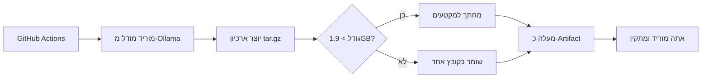

# ollama-models-downloader
# 🤖 Ollama Models Downloader

[](https://github.com/YOUR_USERNAME/ollama-models-downloader/actions/workflows/download-ollama-models.yml)

**הורד מודלי AI של Ollama דרך GitHub Actions - בלי חסימות NetFree!**

---

## 📊 למה זה עובד?

| חסימת NetFree | הפתרון |
|---------------|---------|
| ❌ Ollama Registry | ✅ GitHub Actions מוריד |
| ❌ Docker Hub | ✅ GitHub Actions בונה |
| ❌ הורדה ישירה (>2GB) | ✅ מחתך אוטומטית |

**הכל דרך GitHub Actions = אפס חסימות!**

---

## ⚡ התחלה מהירה (3 דקות)

### 1️⃣ הפעל הורדה

1. לך ל-**Actions** ← **Download Ollama Models**
2. לחץ **Run workflow**
3. בחר מודל: `llama3.1:8b` (מומלץ להתחלה)
4. המתן 10-15 דקות

### 2️⃣ הורד את התוצאה

1. חזור ל-**Actions** ← הריצה שלך
2. גלול למטה ל-**Artifacts**
3. לחץ להוריד `ollama-model-llama3.1:8b-XXX.zip`
4. חלץ את הקובץ

### 3️⃣ התקן והרץ

#### אם קובץ אחד (`models.tar.gz`):
```powershell
# Windows
tar -xzf models.tar.gz -C $env:USERPROFILE\.ollama\
```

```bash
# Linux/Mac
tar -xzf models.tar.gz -C ~/.ollama/
```

#### אם מקטעים (`part_aa`, `part_ab`...):
```powershell
# Windows
.\reassemble.ps1
```

```bash
# Linux/Mac
./reassemble.sh
```

#### או השתמש בסקריפט Python:
```bash
python install_ollama_models.py ./ollama-models-export
```

---

## 📦 מודלים זמינים

| מודל | גודל | זמן הורדה | שימוש מומלץ |
|------|------|-----------|------------|
| **llama3.1:8b** ⭐ | 4.9GB | ~10 דק' | מאוזן, מומלץ להתחלה |
| **mistral:7b** 🏃 | 4.1GB | ~8 דק' | קל ומהיר לבדיקות |
| **llama3.1:70b** 🏆 | 40GB | ~60 דק' | עברית מצוינת, IVR, שידוכים |
| **mixtral:8x7b** ⚡ | 26GB | ~40 דק' | 8 מומחים במקביל |
| **llava:13b** 👁️ | 10GB | ~20 דק' | ראייה ממוחשבת, OCR |
| **codellama:34b** 💻 | 20GB | ~30 דק' | תכנות מתקדם |
| **qwen2.5:72b** 🌏 | 42GB | ~65 דק' | רב-לשוני (עברית+סינית) |
| **deepseek-coder:33b** 🚀 | 19GB | ~30 דק' | GPT-4 לקוד |

---

## 🛠️ כלים נוספים

### בדיקת תקינות
```bash
python check_ollama_health.py
```

בודק:
- ✅ Ollama מותקן
- ✅ שירות פועל
- ✅ מודלים זמינים
- ✅ תיקיות תקינות
- ✅ מריץ בדיקת מודל

### התקנה אוטומטית
```bash
python install_ollama_models.py <path-to-extracted-folder>
```

מטפל:
- ✅ זיהוי פורמט אוטומטי
- ✅ חיבור מקטעים
- ✅ חילוץ למקום נכון
- ✅ אימות התקנה

---

## 🎯 דוגמאות שימוש

### שאלות ותשובות בעברית
```bash
ollama run llama3.1:8b "מהי בירת ישראל?"
```

### תכנות
```bash
ollama run codellama:34b "Write a Python function to reverse a string"
```

### ראייה ממוחשבת
```bash
ollama run llava:13b "Describe this image: /path/to/image.jpg"
```

---

## 🔧 התקנת Ollama

### Windows
```powershell
winget install Ollama.Ollama
```

או הורד מ: https://ollama.com/download/windows

### Linux/Mac
```bash
curl -fsSL https://ollama.com/install.sh | sh
```

---

## 📖 איך זה עובד?

### תהליך ההורדה:



### למה זה עוקף חסימות?

1. **GitHub Actions** - רץ על שרת של GitHub (לא חסום)
2. **Ollama Registry** - GitHub Actions מוריד (לא אתה)
3. **Artifacts** - GitHub מאפשר הורדה חופשית
4. **חיתוך** - עוקף מגבלת 2GB של GitHub

---

## 🆘 פתרון בעיות

### "ollama: command not found"

**פתרון:** התקן Ollama (ראה למעלה)

### "model not found" אחרי התקנה

**פתרון:**
```bash
# בדוק תיקיית מודלים
ls ~/.ollama/models/

# אם ריקה, נסה להתקין שוב
python install_ollama_models.py ./ollama-models-export
```

### שגיאה בחיבור מקטעים (Windows)

**פתרון:**
```powershell
# חיבור ידני
$files = Get-ChildItem models.tar.gz.part_* | Sort-Object Name
$output = [System.IO.File]::Create("models.tar.gz")
foreach ($file in $files) {
    $bytes = [System.IO.File]::ReadAllBytes($file.FullName)
    $output.Write($bytes, 0, $bytes.Length)
}
$output.Close()
```

### שגיאה בחיבור מקטעים (Linux/Mac)

**פתרון:**
```bash
cat models.tar.gz.part_* > models.tar.gz
tar -xzf models.tar.gz -C ~/.ollama/
```

---

## 💡 טיפים

### למה לבחור llama3.1:8b?
- ✅ גודל סביר (4.9GB)
- ✅ תומך עברית
- ✅ הורדה מהירה (~10 דקות)
- ✅ מאוזן בין מהירות לאיכות

### רוצה מודל אחר?
פשוט הרץ Workflow שוב עם מודל שונה. כל המודלים יכולים להתקיים יחד!

### גיבוי המודלים
```bash
# גיבוי
tar -czf ollama-backup.tar.gz ~/.ollama/models/

# שחזור
tar -xzf ollama-backup.tar.gz -C ~/
```

---

## 📚 קבצים בפרויקט

```
.
├── .github/
│   └── workflows/
│       └── download-ollama-models.yml   # GitHub Actions workflow
├── install_ollama_models.py             # סקריפט התקנה
├── check_ollama_health.py               # בדיקת תקינות
└── README.md                            # המדריך הזה
```

---

## 🤝 תרומה

מצאת באג? יש רעיון לשיפור?

1. פתח **Issue**
2. שלח **Pull Request**
3. שתף עם חברים!

---

## 📄 רישיון

MIT License - חופשי לשימוש ושיתוף

---

## 🌟 כוכבים

אם הפרויקט עזר לך, תן ⭐ ל-repo!

---

## 📞 קישורים

- 🌐 [Ollama Official](https://ollama.com/)
- 📖 [Ollama GitHub](https://github.com/ollama/ollama)
- 💬 [Ollama Discord](https://discord.gg/ollama)

---

**נבנה עם ❤️ כדי לעקוף חסימות ולהנגיש AI לכולם**

